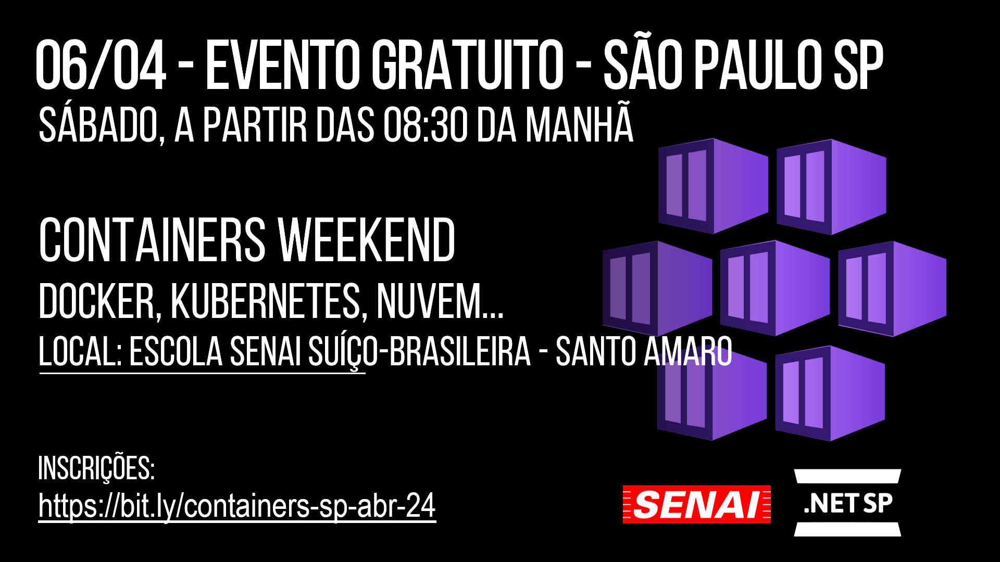
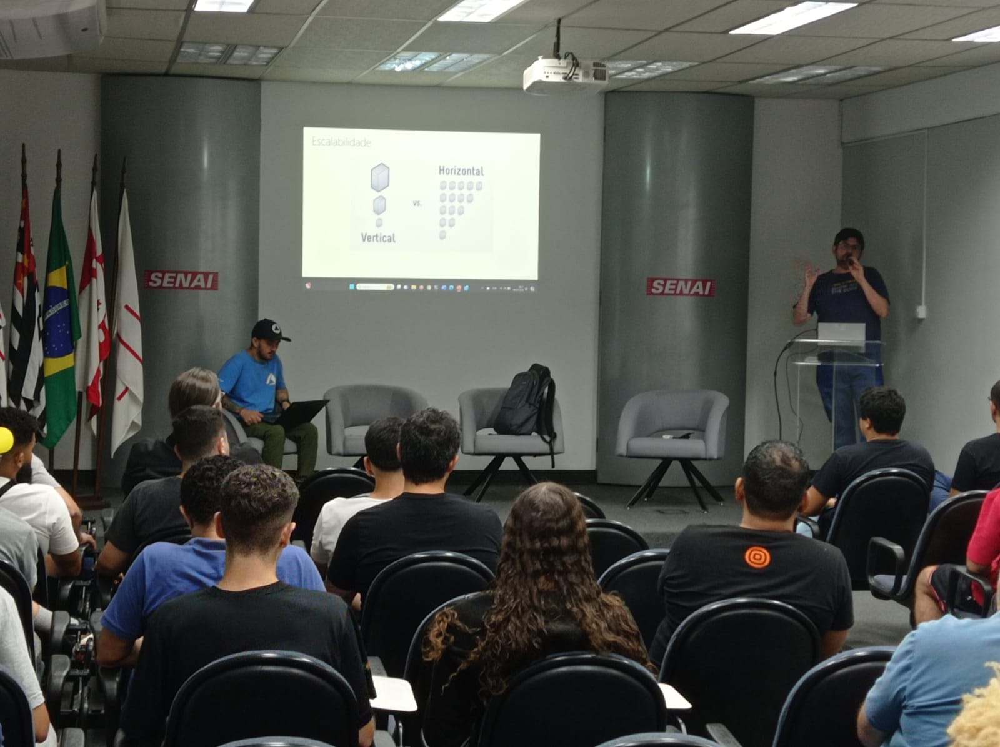
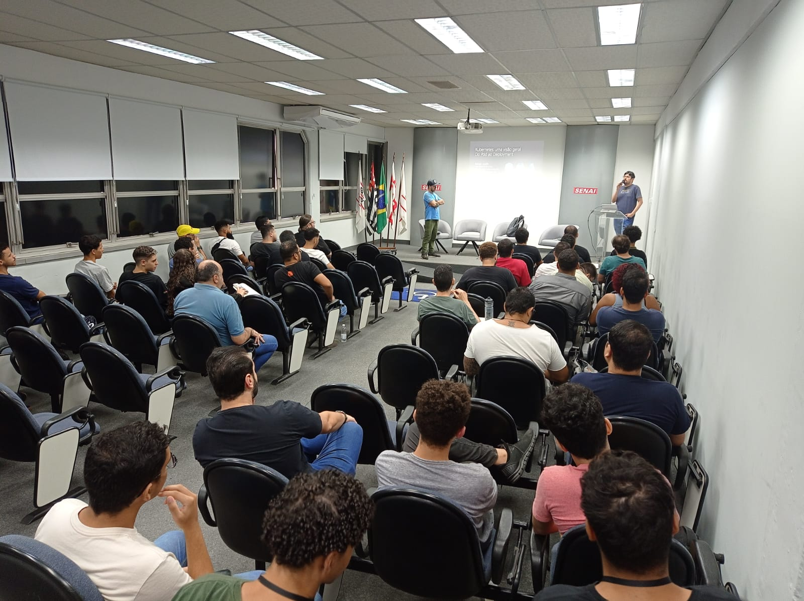
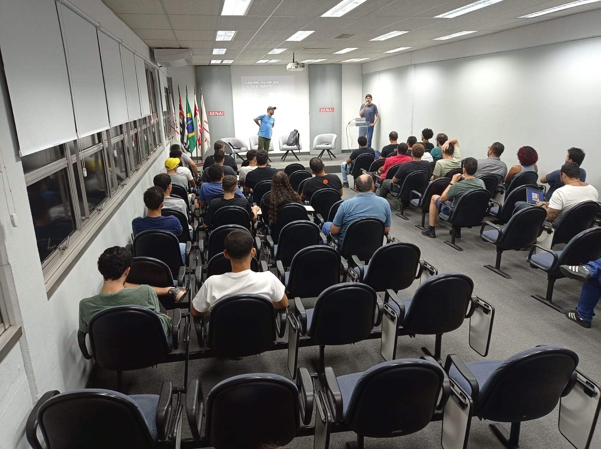
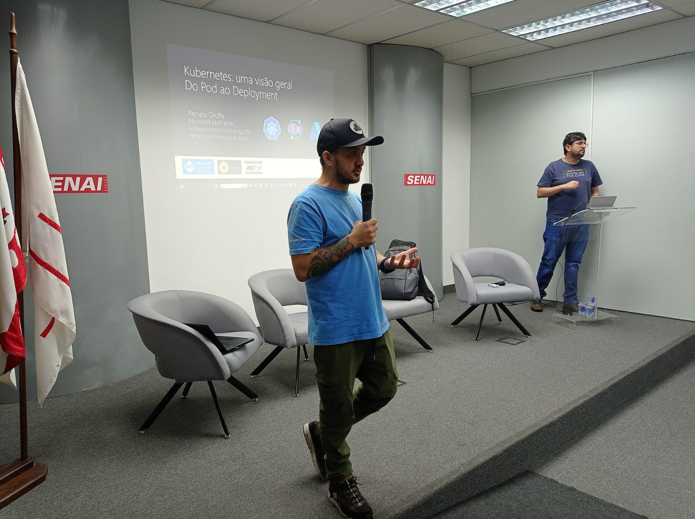

# Containers Weekend 2024
Fotos e informações gerais sobre o evento "Containers Weekend ", realizado em 06/04/2024 na cidade de São Paulo-SP.

Organizadores:
- **Renato Groffe (Microsoft MVP, MTAC)**
- **Milton Camara Gomes (Microsoft MVP, MTAC)**
- **Atila Olivi (SENAI)**

Número de participantes: **54 participantes**

Título da apresentação: **Kubernetes: uma visão geral - Do Pod ao Deployment**

Palestrantes:
- **Renato Groffe (Microsoft MVP, MTAC)**
- **Milton Camara Gomes (Microsoft MVP, MTAC)**

Tecnologias abordadas: **Docker, Kubernetes, KEDA, Azure Kubernetes Service, Linux, Azure App Service, Azure Container Registry, Azure Container Instances, Azure Container Apps, .NET, ASP.NET Core...**

Acesse este [**link**](/img/) para visualizar todas as fotos das apresentações.

Este evento foi uma parceria entre a comunidade [**.NET SP**](https://www.meetup.com/dotnet-Sao-Paulo/) e a [**Escola Senai Suíço-Brasileira Paulo Ernesto Tolle**](https://suicobrasileira.sp.senai.br/).

Formulário utilizado para inscrições: [**Sympla**](https://www.sympla.com.br/evento/containers-weekend-docker-kubernetes-nuvem-gratuito-e-presencial-sao-paulo-sp/2392811)

Local: Escola SENAI Suíço-Brasileira Paulo Ernesto Tolle - Rua Bento Branco de Andrade Filho, 379 - Santo Amaro - São Paulo/SP - CEP 04757-000

---

